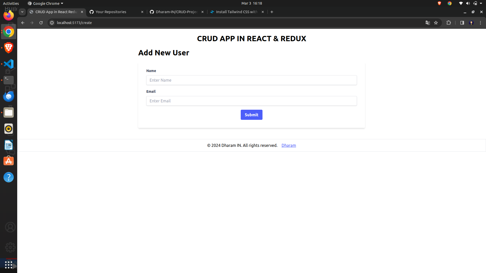

# React CRUD App with Tailwind CSS, Redux Toolkit, and React Router DOM

## Description
This project is a simple CRUD (Create, Read, Update, Delete) application built using React, Tailwind CSS for styling, React Redux for state management, Redux Toolkit for Redux boilerplate reduction, and React Router DOM for navigation.

## Installation
1. Clone this repository:
   ```sh
   git clone https://github.com/Dharam-IN/CRUD-Project-Redux

2. cd CRUD-Project-Redux

3. npm install


## Usage
1. Run the development server:
   ```sh
   npm run dev
   ```
2. Open your web browser and navigate to [http://localhost:5173](http://localhost:5173) to view the app.

## Features
- **Create**: Add new users to the list.
- **Read**: View the list of users with their details.
- **Update**: Update existing user information.
- **Delete**: Remove users from the list.

## Project Structure
```
|-- src
    |-- components
        |-- CreateUser.jsx
        |-- Home.jsx
        |-- Updateuser.jsx
    |-- reducer
        |-- UserReducer.jsx
    |-- App.jsx
    |-- main.jsx
|-- index.html
|-- README.md
```

## Screenshots
- Screenshots.




## Contributing
Contributions are welcome! Feel free to fork this repository and submit pull requests to suggest improvements.

## License
This project is licensed under the [MIT License](LICENSE).
```